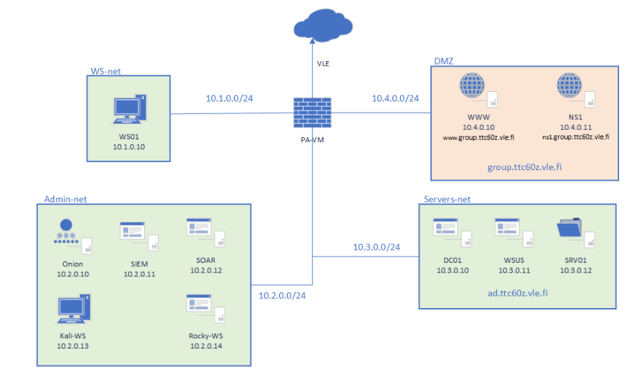

# Cyber Defence
GitHub repository with showcases completed lab assignments from chosen courses of Cyber Defence module. 

**(Reports are in Finnish language)**
**(NOTE:Lab reports are not publicly viewable yet but I can show them in private.)**

Courses were implemented as a group work.

## Environment topology

One virtual environment was used for both courses. 
### Machines

* **WS01** - Workstation Windows machine, used to take remote connections, test applied policies and configurations to web server.
* **PA-VM** - PAN-OS Firewall, primarily used to configure traffic from VLE (Virtual Learning Environment - works as internet), to VLE or from one to another subnet.
* **WWW** - Linux based WordPress web-server.
* **NS1** - Nameserver, primarily used for resolving DNS of WWW-machine
* **DC01** - Windows Server 2019 Domain Controller. Mainly used for managing AD and GPOs of WS01. 
* **WSUS** - Windows Server Update Services. Used for managing updates of other Microsoft machines in environment.
* **SRV01** - Windows Server 2019. Used as fileserver
* **Onion** - Security Onion. 
* **SIEM** - Elastic SIEM.
* **SOAR** - Wazuh EDR.
* **Kali-WS** - Kali machine, used to take remote connections, test applied policies and SIEM/SOAR.
* **Rocky-WS** - Not used during these courses.

## Hardening (TTC6050)

**Course contents**:  The course contains design and implementation of hardening a target ICT environment. Additionally, the course discusses the dependencies and potentials of various data security controls as well as their operation. 
**Course description**: See more about [TTC6050](https://opetussuunnitelmat.peppi.jamk.fi/course/40006?lang=en)

### Lab reports
* [Lab1 - Windows AD, Server and GPOs hardening](/hardening/Lab1.pdf)
* [Lab2 - Windows 11 -workstation hardening ](/hardening/Lab2.pdf)
* [Lab3 - Update management](/hardening/Lab3.pdf)
* [Lab4 - Linux, Docker, Wordpress hardening](/hardening/Lab4.pdf)
* [Lab5 - MFA](/hardening/Lab5.pdf)

These labs were completed as part of a group project. **My contributions included**: 

* Hardening and configuring Windows 11, Windows Server 2019, and Windows Server Update Services.
* Working with a Linux server, setting up two-factor authentication for WordPress.
* Securing SSH by enforcing password authentication, public-key authentication, and 2FA.
* Enhancing website security by acquiring and configuring SSL/TLS certificates using Certbot.
* Writing documentation

## Data Security Controls (TTC6010)

**Course contents**: The course includes an overview of security controls in the perspective of designing and implementing. The course utilizes existing security control frameworks.
**Course description**: See more about [TTC6010](https://opetussuunnitelmat.peppi.jamk.fi/offering/12/46596/39910?lang=en)
### Lab reports
* [Lab01 - Paloalto FW VPN](/dsc/Lab1.pdf)
* [Lab02 - Paloalto FW Rules for Public Services](/dsc/Lab2.pdf)
* [Lab03 - Threat-ID, URL-filtering](/dsc/Lab3.pdf)
* [Lab04 - User-ID & Active Directory integration](/dsc/Lab4.pdf)
* [Lab05 - Logging and SIEM](/dsc/Lab5.pdf)

These labs were completed as part of a group project. **My contributions included**:
* Configuring Palo Alto Firewall for remote access via VPN.
* Managing Security Policies to control incoming and outgoing traffic.
* Enabling NAT and NAT U-turn to allow external access to a web server within the LAN.
* Integrating Palo Alto with Active Directory.
* Managing security certificates and configuring antivirus alerts for specific types of traffic.
* Writing documentation
